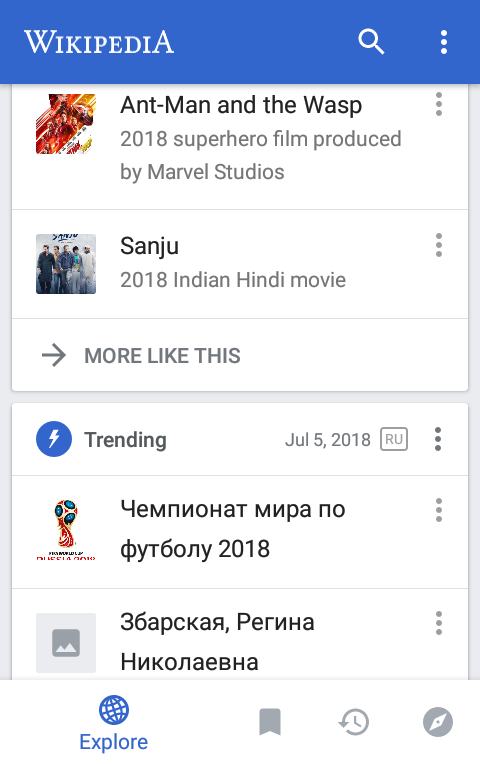

# Multilingual Analytics (Initial Exploration)

On 25 June 2018 the Android team released an update to the Wikipedia app that improved and extended support for multilingual users (see [T160567](https://phabricator.wikimedia.org/T160567) for more information).

The updated features include:
- Ability to set multiple languages
  - Users are prompted during onboarding
  - Users can change their language settings from search and settings screens
- Customize which Explore Feed cards are enabled on a language-by-language basis
- Switch between languages when searching for articles

| Onboarding | Feed customization | Feed |
|:---:|:---:|:---:|
|  |  |  |

The update also included analytics for the new and improved features (discussion and details documented in [T190931](https://phabricator.wikimedia.org/T190931)). This report is an analysis of the data collected.

A PDF of the report will be available on Wikimedia Commons once completed.

## Metrics

- During onboarding
  - % of users who add/remove languages
- Language settings
  - distribution of number of languages set
  - % of users who change their primary language
  - most common languages
  - most common language combinations
- Of users who customized their feed and have >1 language
  - % who picked enabled some cards for one language but not the other
- Search
  - % of searches (performed by bi/multi users) who searched in multiple languages
  - engagement with search results (CTR) by users with one language vs multiple languages
- Engagement with Explore Feed by monolingual vs bilingual vs multilingual (3+)
  - overall clickthrough rate (CTR) regardless of card type
  - non-language-agnostic card CTR
  - most popular languages per card / most popular cards per language
- Reading behavior by mono/bi/multi
  - median session length
  - median pages viewed per session

## Licensing
 
This work is licensed under the Creative Commons Attribution 4.0 International License, so if you see anything you like and want to use, you are welcome to do that with attribution. To view a copy of this license, visit [http://creativecommons.org/licenses/by/4.0/](http://creativecommons.org/licenses/by/4.0/).

